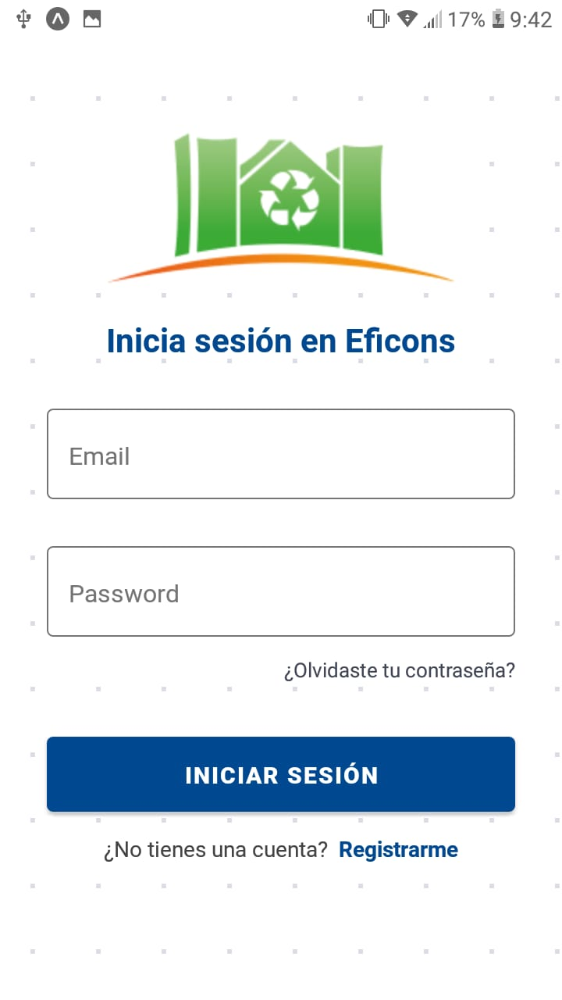
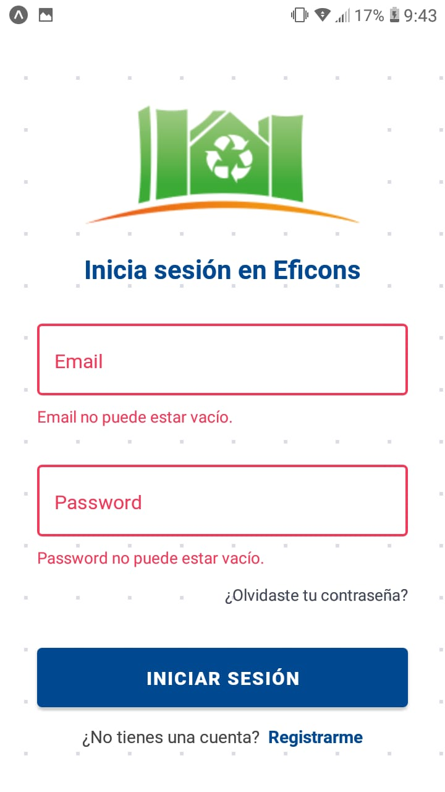

LoginScreen - Plantilla de inicio de sesión simple. Desarrollada en React Native
La forma más sencilla de comenzar con su aplicación.

## Install

### `Clone repository`
`git clone https://github.com/gabrielcasafu/LoginScreen.git`

### `Installing dependencies`
`npm install `

### `Launch`
`npm start`

### `Visualizacion`

